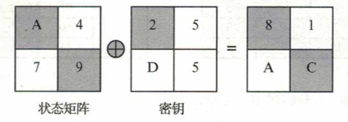
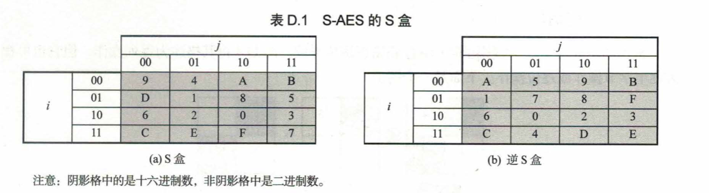
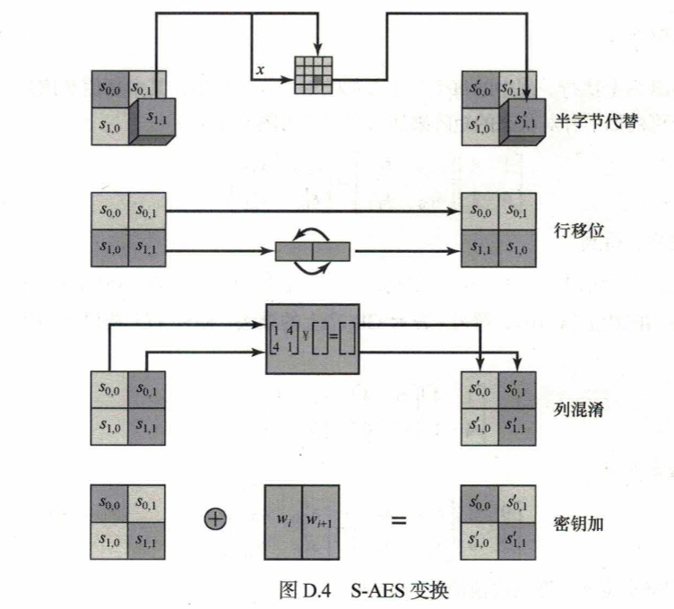
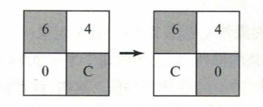
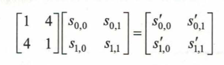
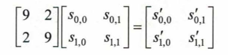
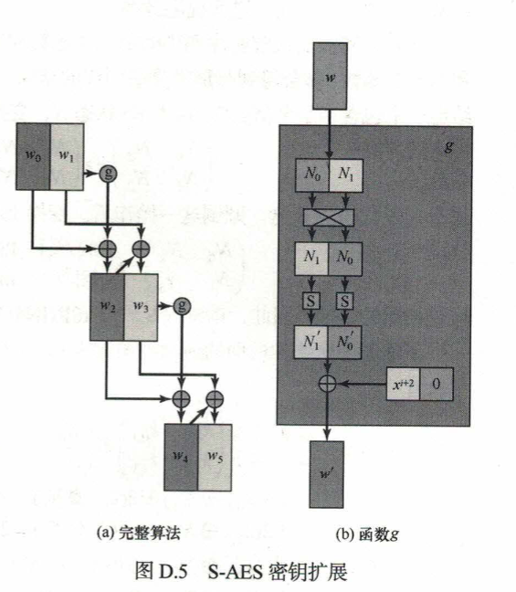
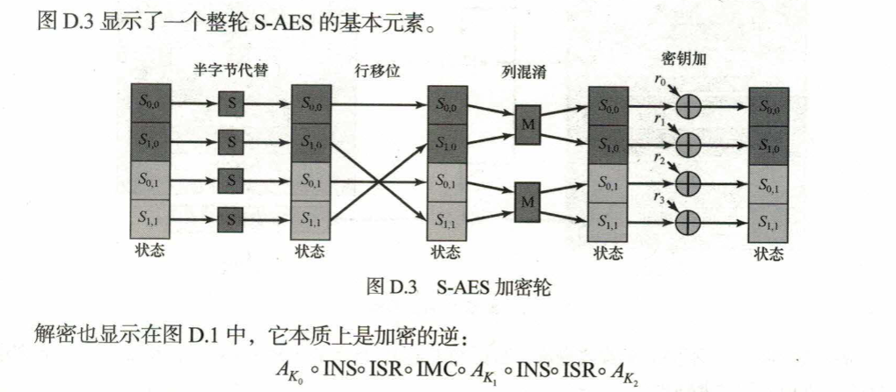

# 开发手册
用于描述 s-AES的python实现中使用的函数  

## S-AES in core
> S-AES 最基本的主体

### 1、数据结构  
对于输入的16位16位进制数————明文、密文、密钥，将其转化为矩阵，称为state  
这个矩阵state 就是后面加/解密模块的操作对象

```python
def int_to_state(n):
    """将16位整数转换为2x2状态矩阵"""
    return [
        [(n >> 12) & 0xF, (n >> 4) & 0xF],
        [(n >> 8) & 0xF, n & 0xF]
    ]
```

### 2、密钥加
密钥加函数将16为状态矩阵与16位轮密钥逐位异或  
>由于异或运算是其本身的逆运算，因此密钥加函数的逆函数与密钥加函数相同  
```python 
def add_round_key(state, round_key):
    """密钥加操作"""
    key_state = int_to_state(round_key)
    return [[state[i][j] ^ key_state[i][j] for j in range(2)] for i in range(2)]
```
  

### 3、半字节代替  
半字节代替函数是简单的查表操作。AES定义一个4x4的半字节值矩阵，称为s-box  
状态中的每个半字节都按以下方式映射到一个新的半字节：
> 半字节最左侧的2位用作行值，最右侧的2位用作列值。行列值用作从s-box中选择唯一的4位输出值的索引。
```python
def sub_nibbles(state, inv=False):
    """半字节替换"""
    box = INV_S_BOX if inv else S_BOX
    return [[box[state[i][j]] for j in range(2)] for i in range(2)]
```



### 4、行移位  
行移位函数在状态的第二行执行一个 半字节循环移位。
>第一行不变，第二行调换
```python
def shift_rows(state, inv=False):
    """行移位"""
    # 行移位是自逆的，加密和解密操作相同
    return [
        [state[0][0], state[0][1]],
        [state[1][1], state[1][0]]
    ]
```  


### 5、列混淆  
$GF(2^4)上的矩阵乘法$  
>**列混淆**     
  

>**逆列混淆**  

```python
def mix_columns(state, inv=False):
    """列混淆"""
    if inv:
        # 逆列混淆矩阵: [[9, 2], [2, 9]]
        return [
            [
                gf_mul(0x9, state[0][0]) ^ gf_mul(0x2, state[1][0]),
                gf_mul(0x9, state[0][1]) ^ gf_mul(0x2, state[1][1])
            ],
            [
                gf_mul(0x2, state[0][0]) ^ gf_mul(0x9, state[1][0]),
                gf_mul(0x2, state[0][1]) ^ gf_mul(0x9, state[1][1])
            ]
        ]
    else:
        # 列混淆矩阵: [[1, 4], [4, 1]]
        return [
            [
                state[0][0] ^ gf_mul(0x4, state[1][0]),
                state[0][1] ^ gf_mul(0x4, state[1][1])
            ],
            [
                gf_mul(0x4, state[0][0]) ^ state[1][0],
                gf_mul(0x4, state[0][1]) ^ state[1][1]
            ]
        ]
```
### 6、密钥扩展  

```python  
def g_function(w, rcon):
    """密钥扩展的g函数"""
    # 半字节旋转
    rot = ((w & 0x0F) << 4) | ((w & 0xF0) >> 4)
    # 半字节替换
    sub = (S_BOX[(rot >> 4) & 0xF] << 4) | S_BOX[rot & 0xF]
    # 轮常数异或
    return (sub & 0x0F) | ((sub & 0xF0) ^ rcon)


def key_expansion(initial_key):
    """密钥扩展，生成轮密钥"""
    w0 = (initial_key >> 8) & 0xFF
    w1 = initial_key & 0xFF
    w2 = w0 ^ g_function(w1, 0x80)  # RCON(1) = 0x80
    w3 = w2 ^ w1
    w4 = w2 ^ g_function(w3, 0x30)  # RCON(2) = 0x30
    w5 = w4 ^ w3
    return [
        (w0 << 8) | w1,  # K0
        (w2 << 8) | w3,  # K1
        (w4 << 8) | w5  # K2
    ]

```

## 加解密  

### 加密
```python
def encrypt(plaintext, key):
    """S-AES加密单个16位分组"""
    if not (0 <= plaintext <= 0xFFFF and 0 <= key <= 0xFFFF):
        raise ValueError("明文和密钥必须是16位整数")

    K0, K1, K2 = key_expansion(key)
    state = int_to_state(plaintext)

    # 第0轮：密钥加
    state = add_round_key(state, K0)

    # 第1轮
    state = sub_nibbles(state)
    state = shift_rows(state)
    state = mix_columns(state)
    state = add_round_key(state, K1)

    # 第2轮
    state = sub_nibbles(state)
    state = shift_rows(state)
    state = add_round_key(state, K2)

    return state_to_int(state)
```

### 解密  
```python 
def decrypt(ciphertext, key):
    """S-AES解密单个16位分组"""
    if not (0 <= ciphertext <= 0xFFFF and 0 <= key <= 0xFFFF):
        raise ValueError("密文和密钥必须是16位整数")

    K0, K1, K2 = key_expansion(key)
    state = int_to_state(ciphertext)

    # 第0轮（对应加密第2轮）
    state = add_round_key(state, K2)
    state = shift_rows(state, inv=True)
    state = sub_nibbles(state, inv=True)

    # 第1轮（对应加密第1轮）
    state = add_round_key(state, K1)
    state = mix_columns(state, inv=True)
    state = shift_rows(state, inv=True)
    state = sub_nibbles(state, inv=True)

    # 第2轮（对应加密第0轮）
    state = add_round_key(state, K0)

    return state_to_int(state)
```

### 多重加解密  
>对前一次加、解密结果 嵌套地 使用加解密算法
```python
def double_encrypt(plaintext, key):
    """双重加密，32位密钥(key = K1 << 16 | K2)"""
    if not (0 <= plaintext <= 0xFFFF and 0 <= key <= 0xFFFFFFFF):
        raise ValueError("明文必须是16位整数，密钥必须是32位整数")

    k1 = (key >> 16) & 0xFFFF  # 前16位作为K1
    k2 = key & 0xFFFF  # 后16位作为K2
    return encrypt(encrypt(plaintext, k1), k2)


def double_decrypt(ciphertext, key):
    """双重解密"""
    if not (0 <= ciphertext <= 0xFFFF and 0 <= key <= 0xFFFFFFFF):
        raise ValueError("密文必须是16位整数，密钥必须是32位整数")

    k1 = (key >> 16) & 0xFFFF
    k2 = key & 0xFFFF
    return decrypt(decrypt(ciphertext, k2), k1)


def triple_encrypt(plaintext, key, mode=1):
    """三重加密
    mode=1: 32位密钥(K1+K2)，模式为K1-K2-K1
    mode=2: 48位密钥(K1+K2+K3)，模式为K1-K2-K3
    """
    if mode == 1:
        if not (0 <= plaintext <= 0xFFFF and 0 <= key <= 0xFFFFFFFF):
            raise ValueError("明文必须是16位整数，密钥必须是32位整数")
        k1 = (key >> 16) & 0xFFFF
        k2 = key & 0xFFFF
        return encrypt(decrypt(encrypt(plaintext, k1), k2), k1)
    else:  # mode=2
        if not (0 <= plaintext <= 0xFFFF and 0 <= key <= 0xFFFFFFFFFFFF):
            raise ValueError("明文必须是16位整数，密钥必须是48位整数")
        k1 = (key >> 32) & 0xFFFF
        k2 = (key >> 16) & 0xFFFF
        k3 = key & 0xFFFF
        return encrypt(decrypt(encrypt(plaintext, k1), k2), k3)


def triple_decrypt(ciphertext, key, mode=1):
    """三重解密"""
    if mode == 1:
        if not (0 <= ciphertext <= 0xFFFF and 0 <= key <= 0xFFFFFFFF):
            raise ValueError("密文必须是16位整数，密钥必须是32位整数")
        k1 = (key >> 16) & 0xFFFF
        k2 = key & 0xFFFF
        return decrypt(encrypt(decrypt(ciphertext, k1), k2), k1)
    else:  # mode=2
        if not (0 <= ciphertext <= 0xFFFF and 0 <= key <= 0xFFFFFFFFFFFF):
            raise ValueError("密文必须是16位整数，密钥必须是48位整数")
        k1 = (key >> 32) & 0xFFFF
        k2 = (key >> 16) & 0xFFFF
        k3 = key & 0xFFFF
        return decrypt(encrypt(decrypt(ciphertext, k3), k2), k1)
```

## 其他功能  
### 模拟中间相遇攻击  
>理论上说如果想要快速地通过 中间相遇攻击 来攻破s-AES，应该使用多线程：一边正向加密，一边逆向解密，同时随着正逆向的推进对比结果是否一致。  
但是过于频繁的比对反而会引入开销  
这里简化实现：
```python 
def meet_in_the_middle(plaintext, ciphertext):
    """中间相遇攻击，寻找双重加密的32位密钥"""
    if not (0 <= plaintext <= 0xFFFF and 0 <= ciphertext <= 0xFFFF):
        raise ValueError("明文和密文必须是16位整数")

    # 存储所有可能的K1及其对应的中间值
    forward = {}
    for k1 in range(0x10000):
        intermediate = encrypt(plaintext, k1)
        forward[intermediate] = k1

    # 寻找匹配的K2
    for k2 in range(0x10000):
        intermediate = decrypt(ciphertext, k2)
        if intermediate in forward:
            # 找到可能的密钥对
            k1 = forward[intermediate]
            return (k1 << 16) | k2  # 组合成32位密钥

    return None  # 未找到密钥
```  

### CBC 密码分组链模式 
```python
def cbc_encrypt(plaintext_bytes, key, iv=None):
    """
    CBC模式加密
    plaintext_bytes: 明文字节串
    key: 16位密钥
    iv: 16位初始向量，None则自动生成
    返回: (密文字节串, iv)
    """
    if iv is None:
        iv = random.getrandbits(16)  # 生成随机IV

    # 填充明文，使其长度为2的倍数
    pad_length = (2 - (len(plaintext_bytes) % 2)) % 2
    plaintext_bytes += bytes([pad_length]) * pad_length

    ciphertext_bytes = b""
    prev_block = iv

    # 按2字节一组处理
    for i in range(0, len(plaintext_bytes), 2):
        # 提取2字节明文并转换为16位整数
        block = int.from_bytes(plaintext_bytes[i:i + 2], byteorder='big')
        # 与前一个密文块异或
        block ^= prev_block
        # 加密
        cipher_block = encrypt(block, key)
        # 保存密文块
        ciphertext_bytes += cipher_block.to_bytes(2, byteorder='big')
        # 更新前一个密文块
        prev_block = cipher_block

    return (ciphertext_bytes, iv)


def cbc_decrypt(ciphertext_bytes, key, iv):
    """
    CBC模式解密
    ciphertext_bytes: 密文字节串
    key: 16位密钥
    iv: 16位初始向量
    返回: 明文字节串（去除填充）
    """
    if len(ciphertext_bytes) % 2 != 0:
        raise ValueError("密文长度必须是2的倍数")

    plaintext_bytes = b""
    prev_block = iv

    # 按2字节一组处理
    for i in range(0, len(ciphertext_bytes), 2):
        # 提取2字节密文并转换为16位整数
        cipher_block = int.from_bytes(ciphertext_bytes[i:i + 2], byteorder='big')
        # 解密
        block = decrypt(cipher_block, key)
        # 与前一个密文块异或
        block ^= prev_block
        # 保存明文块
        plaintext_bytes += block.to_bytes(2, byteorder='big')
        # 更新前一个密文块
        prev_block = cipher_block

    # 去除填充
    pad_length = plaintext_bytes[-1] if plaintext_bytes else 0
    if pad_length < 1 or pad_length > 2:
        return plaintext_bytes  # 填充异常，返回原始数据
    return plaintext_bytes[:-pad_length]
```