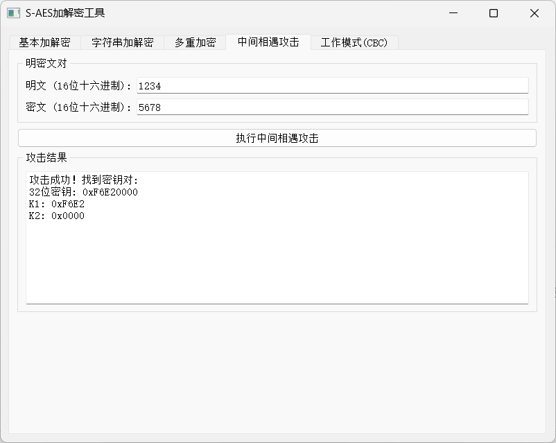

# 用户手册
此文档用于帮助用户了解该程序的使用方法  
## 启动  
使用python运行main.py

## 界面
  
>通过点击上方的选项卡进行界面切换  
### (1) 基本加解密  
输入：16位16进制的 **明文/密文** + **密钥**  
输出：16位16进制：**0x...**  

### (2) 字符串加解密
支持接受**字符串**形式的明/密文  

### （3）多重加密
  
> 通过下拉列表可以选择加密类型，对于不同的加密方式请用户采取对应长度的密钥

### (4)中间相遇攻击  

> 模拟中间相遇攻击  

### （5）CBC模式
>CBC密码分组链模式：每个明文分组在加密前都会与前一个密文分组进行异或操作，然后再进行加密。第一个明文分组由于没有前一个密文分组，因此需要使用一个初始化向量（IV）来代替。
