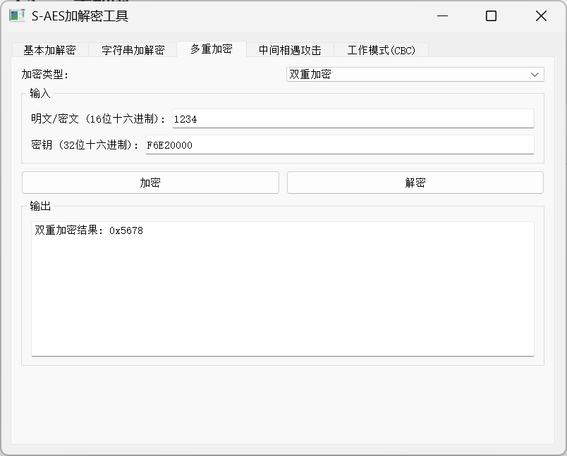
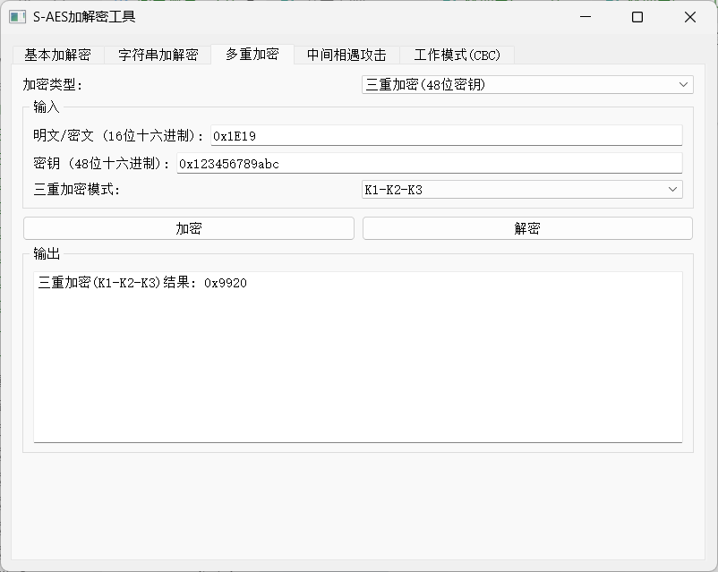

# 闯关结果
## 1、基本测试
>根据S-AES算法编写和调试程序，提供GUI解密支持用户交互。输入可以是16bit的数据和16bit的密钥，输出是16bit的密文。  

测试用明文：0xcccc（16位16进制）  
密钥：0xaaaa  
如图所示，**加密结果为0x4381**  

解密用密文：0x4381  
密钥：0xaaaa  
得到最初输入0xcccc  

## 2、交叉测试
> 考虑到是**算法标准**，所有人在编写程序的时候需要使用相同算法流程和转换单元(替换盒、列混淆矩阵等)，以保证算法和程序在异构的系统或平台上都可以正常运行。设有A和B两组位同学(选择相同的密钥K)；则A、B组同学编写的程序对明文P进行加密得到相同的密文C；或者B组同学接收到A组程序加密的密文C，使用B组程序进行解密可得到与A相同的P。  

对方组采用不同的编程语言Java，  
### 同向加密
密钥：0x0000  
明文：0x0000  
>对方得到的密文是：0x071E
  
>我方得到的密文是：0x071E
  
双方得到的密文相同  

## 3、拓展功能
> 考虑到向实用性扩展，加密算法的数据输入可以是ASII编码字符串(分组为2 Bytes)，对应地输出也可以是ACII字符串(很可能是乱码)。
笔者考虑到ascii码的字符映射有限，并且不同的拓展ascii方案的字符映射不尽相同，这里对此功能的验证标准设置为衡量 **加密过后16进制块**  
并且本程序合法的输入、输出为标准ascii编码的字符串；不合法的输入会被拒绝，不合法的输出会丢失内容。

如下图所示，输入为ascii字符串**susan**  
输出包含了**原始字符串**、**加密后块**、加密后字符串按latin-1**解码后的字符串**  

如果尝试将得到的字符串解密，会因为输入不合法而被拒绝  

## 4、多重加密
### 4.1、双重加密
>将S-AES算法通过双重加密进行扩展，分组长度仍然是16 bits，但密钥长度为32 bits  

明文：0xCCCC  
密钥：0x12345678  
结果：0xEF8F  
  

### 4.2、中间相遇攻击
>假设你找到了使用相同密钥的明、密文对(一个或多个)，请尝试使用中间相遇攻击的方法找到正确的密钥Key(K1+K2)。  

明文：0x1234  
对应的密文：0x5678  
中间相遇攻击得到的**密钥**为：0xF6E20000

根据得到的密钥对明文进行正向加密，成功得到对应的密文0x5678  

### 4.3、三重加密
>将S-AES算法通过三重加密进行扩展，下面两种模式选择一种完成：  
(1)按照32 bits密钥Key(K1+K2)的模式进行三重加密解密，  
(2)使用48bits(K1+K2+K3)的模式进行三重加解密。 

#### 本程序两种模式均可，通过下拉菜单切换 
（1） K1-K2-k1  
明文：0xaaaa  
32位密钥：0x12345678  
  
  

（2）k1-k2-k3  
明文：0x1E19  
48位密钥：0x123456789abc  
  

## 5、工作模式
>基于S-AES算法，使用密码分组链(CBC)模式对较长的明文消息进行加密。注意初始向量(16 bits) 的生成，并需要加解密双方共享。在CBC模式下进行加密，并尝试对密文分组进行替换或修改，然后进行解密，请对比篡改密文前后的解密结果  

明文字符串：Hello Iam Bay Max  
密钥：

  

将加密得到的密文复制到文本框，进行解密  

对密文进行篡改，在相同的情况下进行解密  
**将密文的第三位9改为5**  
观察到经过篡改后，所解得明文与原始明文有不小的差距，接收者可以立刻知道该信息已被人纂改/替换。  

